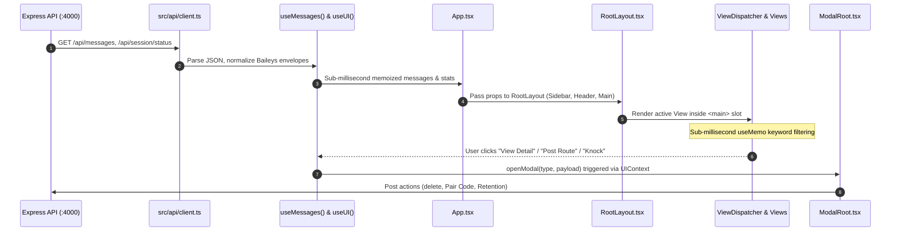

# Frontend Codebase Graph Map & Architectural Matrix

> **Telcia Wholesale Telecom Intelligent Agent**  
> **Framework:** React 19 + Vite 6 SPA | **Architecture:** Next.js-inspired Content Layering  
> **Version:** 2.0.0 (Production Stable) | **Last Updated:** 2026-10-06  

---

## 1. High-Level Architectural Layering Graph

```mermaid
flowchart TD
    subgraph L0["Layer 0: Entry & DOM Mount"]
        HTML["index.html"] --> Main["src/main.tsx"]
        Main --> App["src/App.tsx"]
    end

    subgraph L1["Layer 1: Context & State Providers"]
        App --> UIProv["src/context/UIContext.tsx<br/>(UIProvider: View, Sidebar, Modals, Theme)"]
        UIProv --> ShortcutsHook["src/hooks/useShortcuts.ts<br/>(Keys 1-9, Esc, Backslash, ?)"]
    end

    subgraph L2["Layer 2: Next.js Layout Shell"]
        UIProv --> RootLay["src/layouts/RootLayout.tsx"]
        RootLay --> Ribbon["src/components/layout/BangladeshRibbon.tsx"]
        RootLay --> Sidebar["src/components/layout/AppSidebar.tsx"]
        RootLay --> Header["src/components/layout/AppHeader.tsx"]
        RootLay --> Slot["<main id='main-content-scroll'> Slot"]
    end

    subgraph L3["Layer 3: Router & View Dispatcher (Lazy Code-Split)"]
        Slot --> Dispatcher["src/components/views/ViewDispatcher.tsx<br/>(React.lazy code splitting & Suspense fallback)"]
    end

    subgraph L4["Layer 4: Modular View Modules (9 Views)"]
        Dispatcher --> V1["RoutesView.tsx (Route Matrix)"]
        Dispatcher --> V2["TrendsView.tsx (Market Trends - Lazy)"]
        Dispatcher --> V3["InsightsView.tsx (AI Insights - Lazy)"]
        Dispatcher --> V4["NewsView.tsx (Telco Outages - Lazy)"]
        Dispatcher --> V5["VendorsView.tsx (Carrier Directory - Lazy)"]
        Dispatcher --> V6["TerminalView.tsx (Live Stream - Fixed Viewport)"]
        Dispatcher --> V7["PipelineView.tsx (System AI - Lazy)"]
        Dispatcher --> V8["DevView.tsx (API Lab - Lazy)"]
        Dispatcher --> V9["SettingsView.tsx (Terminal Config - Lazy)"]
    end

    subgraph L5["Layer 5: Terminal Stream Sub-System"]
        V6 --> C1["src/hooks/useTerminalController.ts<br/>(120ms Debounced Search, Haystack Cache, Pagination)"]
        V6 --> S1["StreamFilterBar.tsx (Pinned Header)"]
        V6 --> S2["StreamTable.tsx (Scrollable Viewport)"]
        V6 --> S3["StreamPaginationBar.tsx (Pinned Footer)"]
        S2 --> S4["MessageRow.tsx (React.memo Optimized)"]
    end

    subgraph L6["Layer 6: Centralized Modal Lifecycle Manager"]
        App --> ModalRoot["src/components/modals/ModalRoot.tsx"]
        ModalRoot --> M1["AuthOverlay.tsx"]
        ModalRoot --> M2["DeviceModal.tsx (QR & Code)"]
        ModalRoot --> M3["StorageModal.tsx"]
        ModalRoot --> M4["DataManagementModal.tsx"]
        ModalRoot --> M5["RouteDetailModal.tsx"]
        ModalRoot --> M6["PostRouteModal.tsx"]
        ModalRoot --> M7["AiSettingsModal.tsx"]
        ModalRoot --> M8["ShortcutsModal.tsx"]
        ModalRoot --> M9["MessageDetailModal.tsx"]
        ModalRoot --> M10["deleteConfirmModal.tsx"]
    end

    subgraph L7["Layer 7: Data Hooks & API Transport"]
        App --> MsgHook["src/hooks/useMessages.ts"]
        MsgHook --> ApiClient["src/api/client.ts"]
        RootLay --> ApiClient
        ModalRoot --> ApiClient
    end

    subgraph L8["Layer 8: Backend Node.js Server"]
        ApiClient <-->|REST API + Bearer HMAC| Server["Express Server (:4000)"]
    end
```

---

## 2. Unidirectional Data & State Flow

---

## 3. Detailed Component & File Registry Matrix

| Layer | File Path | Primary Responsibility | Key Exported Symbols | Depends On |
| :--- | :--- | :--- | :--- | :--- |
| **L0** | `src/main.tsx` | React 19 root DOM mount, strict mode bootstrap | Default mount | `App.tsx`, `index.css` |
| **L0** | `src/App.tsx` | Top-level container, hooks initialization, memoized filtering | `App`, `AppInner` | `UIProvider`, `RootLayout`, `ViewDispatcher`, `ModalRoot` |
| **L1** | `src/context/UIContext.tsx` | Navigation router state, sidebar toggle, dark/light theme, modals | `UIProvider`, `useUI` | `types/status.ts` |
| **L1** | `src/hooks/useShortcuts.ts` | Global keyboard listener (Keys 1-9, `\`, `?`, `/`, `Esc`) | `useShortcuts` | `UIContext.tsx` |
| **L1** | `src/hooks/useTerminalController.ts` | Terminal stream search debouncing (120ms), haystack cache, pagination & exports | `useTerminalController` | `types/message.ts` |
| **L2** | `src/layouts/RootLayout.tsx` | Next.js-inspired page shell: Bangladesh ribbon, sidebar, header, main slot | `RootLayout` | `BangladeshRibbon`, `AppSidebar`, `AppHeader`, `UIContext` |
| **L2** | `src/components/layout/BangladeshRibbon.tsx` | Sovereign 2.5px micro-ribbon national gradient | `BangladeshRibbon` | None |
| **L2** | `src/components/layout/AppSidebar.tsx` | 9 navigation tabs, badges, WhatsApp QR button, disk meter | `AppSidebar`, `ViewType` | `types/message.ts`, `types/status.ts` |
| **L2** | `src/components/layout/AppHeader.tsx` | Dynamic view header, status pill, AI badge, controls, lock | `AppHeader` | `AppSidebar`, `types/status.ts` |
| **L3** | `src/components/views/ViewDispatcher.tsx` | Router switch that matches `activeView` to target View | `ViewDispatcher` | All 9 View components, `UIContext` |
| **L4** | `src/components/views/RoutesView.tsx` | Route Matrix, KPI strip, search, rate copy, knock WhatsApp | `RoutesView`, `RouteItem` | `formatters.ts` |
| **L4** | `src/components/views/TrendsView.tsx` | Market Trends, KPI strip, SVG price chart, period filter | `TrendsView` | None |
| **L4** | `src/components/views/InsightsView.tsx` | Arbitrage buy/sell spread matchmaker, AI pitch generator | `InsightsView` | None |
| **L4** | `src/components/views/NewsView.tsx` | High-scale scrollable news feed, priority & recency engine, search, categories, radar beacons | `NewsView` | `api/client.ts` (`fetchNews`, `BackendNewsItem`) |
| **L4** | `src/components/views/VendorsView.tsx` | Carriers & vendor cards, phone copy, knock WhatsApp | `VendorsView` | `formatters.ts` |
| **L4** | `src/components/views/TerminalView.tsx` | Live WhatsApp stream view container | `TerminalView` | `StreamFilterBar`, `StreamTable`, `StreamPaginationBar` |
| **L4** | `src/components/views/PipelineView.tsx` | 5-stage architecture flowchart, SQLite WAL status | `PipelineView` | None |
| **L4** | `src/components/views/DevView.tsx` | Inbound message simulation test bench | `DevView` | `api/client.ts` |
| **L4** | `src/components/views/SettingsView.tsx` | Terminal configuration, ADR-013 zero-seen policy toggle | `SettingsView` | `types/status.ts` |
| **L5** | `src/components/common/ProfileAvatar.tsx` | Deterministic carrier trader & group avatar system (/avatars/*.svg) | `ProfileAvatar` | Lucide icons, `types/message.ts` |
| **L5** | `src/components/stream/StreamTable.tsx` | Semantic HTML table (`<table>`) for live stream | `StreamTable` | `MessageRow.tsx` |
| **L5** | `src/components/stream/MessageRow.tsx` | Semantic `<tr>` row with avatar, media chip, knock button | `MessageRow` | `formatters.ts`, `types/message.ts`, `ProfileAvatar.tsx` |
| **L5** | `src/components/stream/StreamFilterBar.tsx` | Keyword search input (`/`), chat type filter, export buttons | `StreamFilterBar` | None |
| **L5** | `src/components/stream/StreamPaginationBar.tsx` | Page size selector (10, 25, 50, 100, All), prev/next buttons | `StreamPaginationBar` | None |
| **L6** | `src/components/modals/ModalRoot.tsx` | Central modal manager rendering active modal overlays | `ModalRoot` | All modal components, `UIContext` |
| **L6** | `src/components/modals/AuthOverlay.tsx` | Terminal password unlock gate (`wapp2026`) | `AuthOverlay` | `api/client.ts` |
| **L6** | `src/components/modals/DeviceModal.tsx` | QR code pairing, 8-digit phone code pairing, reset session | `DeviceModal` | `types/status.ts` |
| **L6** | `src/components/modals/StorageModal.tsx` | Disk space %, media delete, 30-day retention prune | `StorageModal` | None |
| **L6** | `src/components/modals/DataManagementModal.tsx` | Accidental data loss protection banner, selective delete | `DataManagementModal` | None |
| **L6** | `src/components/modals/RouteDetailModal.tsx` | Route specs, copy trade ticket, AI pitch, WhatsApp knock | `RouteDetailModal`, `RouteDetailItem` | `formatters.ts` |
| **L6** | `src/components/modals/PostRouteModal.tsx` | Broadcast wholesale voice route form | `PostRouteModal` | None |
| **L6** | `src/components/modals/AiSettingsModal.tsx` | LLM selector (DeepSeek, ChatGPT, Grok, Regex), API keys | `AiSettingsModal` | None |
| **L6** | `src/components/modals/ShortcutsModal.tsx` | Trader keyboard shortcuts help table | `ShortcutsModal` | None |
| **L6** | `src/components/modals/MessageDetailModal.tsx` | Verbatim WhatsApp message inspector, raw JSON viewer | `MessageDetailModal` | `formatters.ts`, `types/message.ts` |
| **L6** | `src/components/modals/deleteConfirmModal.tsx` | Raw stream delete confirmation modal | `deleteConfirmModal` | None |
| **L7** | `src/hooks/useMessages.ts` | Message polling, stats computation, delete trigger | `useMessages` | `api/client.ts`, `types/message.ts` |
| **L7** | `src/api/client.ts` | Typed fetch wrapper, Bearer HMAC token storage, REST calls | `fetchMessages`, `fetchDeviceStatus`, etc. | `types/message.ts`, `types/status.ts` |
| **L7** | `src/utils/formatters.ts` | Date/time formatters, phone number sanitizer, avatar colors | `formatTime`, `cleanPhone`, `getInitials`, etc. | None |

---

## 4. Rapid Diagnostic Troubleshooting Matrix

When encountering an issue, use this map to navigate directly to the root cause:

| Symptom | Root Cause Area | Primary File to Inspect | Secondary Verification |
| :--- | :--- | :--- | :--- |
| **View doesn't change on navigation** | Hash or UIContext out of sync | `src/context/UIContext.tsx` | `src/components/views/ViewDispatcher.tsx` |
| **Hotkeys (1-9, Esc, ?) not firing** | Event listener blocked or missing hook | `src/hooks/useShortcuts.ts` | Check if input element is currently focused |
| **Modal doesn't appear when clicked** | Modal identifier mismatch | `src/components/modals/ModalRoot.tsx` | Check `openModal('id', payload)` call |
| **API returns 401 Unauthorized** | Missing HMAC cookie or Bearer token | `src/api/client.ts` (`authenticatedFetch`) | Verify `localStorage.getItem('wapp_token')` |
| **Stream table columns misaligned** | Non-semantic HTML or CSS padding bug | `src/components/stream/StreamTable.tsx` | Check `src/components/stream/MessageRow.tsx` |
| **Filter or search feels sluggish** | Re-filtering on every keystroke without memo | `src/App.tsx` (`useMemo` over `messages`) | Ensure `pageSize` slice is working |
| **Theme toggle doesn't update styles** | `.dark` class not toggled on `<html>` | `src/context/UIContext.tsx` (`toggleTheme`) | Check `src/css/theme.css` tokens |
| **WhatsApp device status shows offline** | Polling error in session endpoint | `src/api/client.ts` (`fetchDeviceStatus`) | Check Node backend `GET /api/session/status` |
| **Modal stretches across 100vw** | Container max-width missing | `src/components/modals/RouteDetailModal.tsx` | Check `modals.css` default `max-width: 36rem` |
| **Route pricing tiers not highlighted** | Unique prices sort missing | `src/components/views/RoutesView.tsx` | Check `uniquePrices` useMemo and Top 3 badges |
| **Urgent outage alerts not flashing** | Animate-pulse / ping omitted | `src/components/views/NewsView.tsx` | Check `isHigh` condition with dual-ring beacon |
